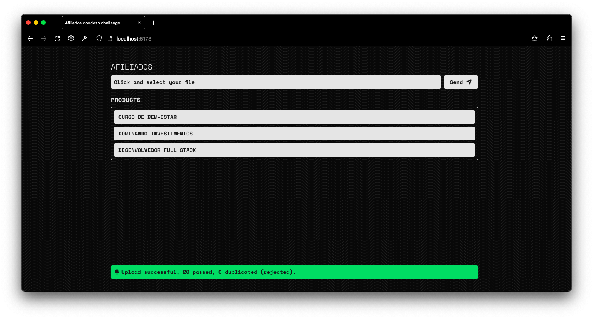
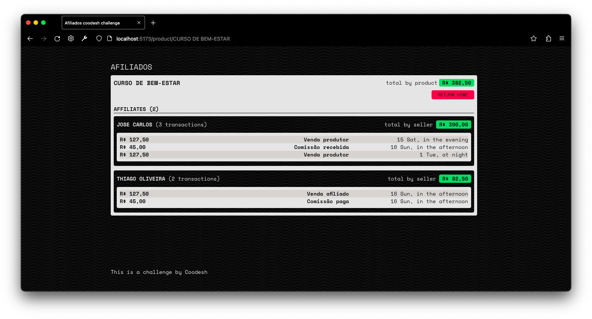

# Fullstack afiliados - [Coodesh](https://coodesh.com)

Despite encountering some challenges, mostly related to Docker and comming from Jest to Vitest, I'm very happy with the results. The challenge itself was straightforward, but it made me think a lot. I found the README for the challenge to be a little unclear (maybe on purpose), so I feel allowed me to let my creativity flow. As a result, I explored various approaches and ultimately arrived at a very satisfying architectural solution.




## Languages and Frameworks
+ Typescript
+ Node
+ React
+ PostgreSQL
+ Prisma 
+ Wouter
+ TailwindCSS
+ Vite
+ Vite-plugin-Node
+ CORS
+ Crypto-JS

## Getting Started

As I write this, I haven't dockerized the project yet; hopefully, you won't even read that.
UPDATE: I give up. Docker is genually the worse app I've ever seen.

### How to install

> Since Docker hasn't yet been integrated, I've created a seamless process:

Clone the repository:
```
    git clone https://github.com/caiankeller/afiliados caiankeller@afiliados
```

Enter the directory:
```
    cd caiankeller@afiliados
```

Install dependencies:
```
    npm run setup
```

> This will install both directories' dependencies, generate prisma, and seed... (way better than lagocker, ops docker).

> I might not be the most knowledgeable person when it comes to Prisma, but I tested it and confirmed that it successfully created the database.

### Run it

So, just run it with:
```
    npm run start
```

Simple as that 😁. The only .ENV to be filled is /server/.env, with the database URL (that uses postgreSQL)

Access the project [here](http://localhost:5173). The API is also available [here](http://localhost:1707). By default, the root API endpoint will redirect to the React app URL.

There're a plenty of comments, enjoy.

> This is a challenge by Coodesh